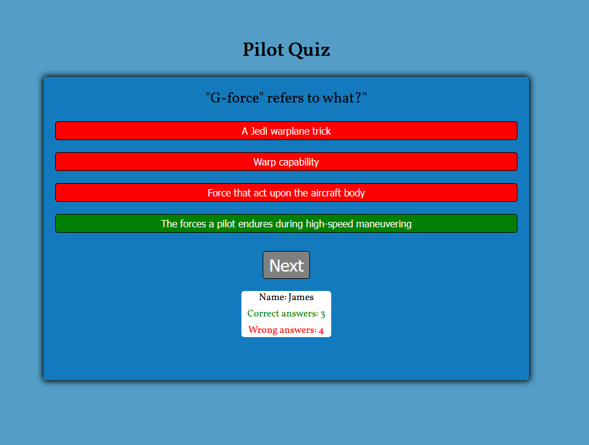
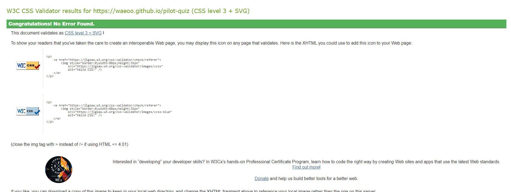
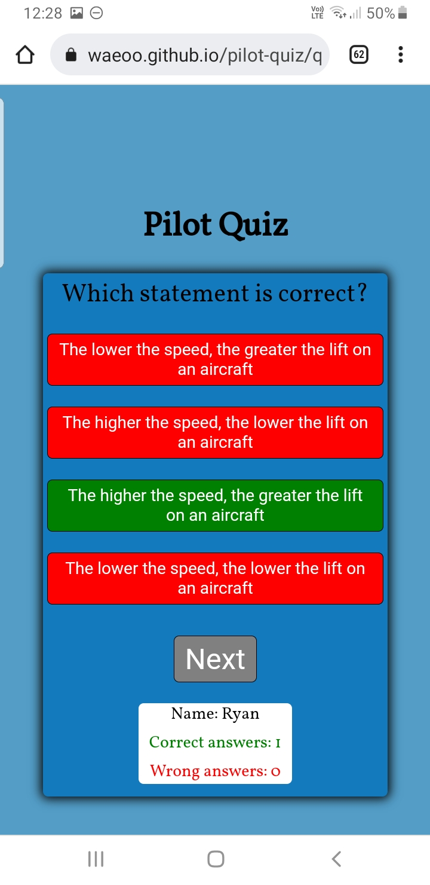

# Pilot Quiz

- This project was created to provide a Pilot Quiz with questions in relation to aviation for anyone to test themselves on their knowledge. 

- The quiz is for anyone interested in aviation or want to take a quiz in relation to aviation regardless of interest.

## User Stories

- As a new visitor visiting the site I want to early know what the site is about and refering to and to quickly discern if it is suitable for what I'm after.

- As a general visitor I want to test my skills and  navigation and to the parts of releveance. 
Learn and study the information provided and easily find the websites social links.
Be able to contact anyone behind the website.

- As a returning visitor I want to see any updated information and redo the quiz as many times as I want.

## UX

- Design concept was chosen in relation to aviation and the sites purpose of being in an direction of quiz.

### Color Scheme

- Described color scheme for `#539dc7`, `147abe`, `green`, `red`, `black`.
- Colors used for this project are in relation to the sky, therefor with a blue direction and also from color tools [Color Tool](https://material.io/) to match eachother.

### Typography

- I choose [Vollkorn](https://fonts.google.com/specimen/Vollkorn) due to the quiz purpose font selection.
- For the icons used I choosed an aircraft picture for the favicon icon.

### Wireframes

  - [index.html](https://waeoo.github.io/pilot-quiz/index.html)
  

  - [quiz.html](https://waeoo.github.io/pilot-quiz/quiz.html)
  

## Features

### Existing Features

- __The Home page and welcome message__

  - The home page include a welcoming message and asking the visitor to enter their name prior to taking the quiz.
  - After a name has been entered the visitor can start the quiz.

- __The Pilot Quiz page__

  - The Pilot Quiz page will allow the user to read and learn about the different well-researched adaptogens listed. 
  - The user will find valueable information about the nine different adaptogens listed in order to spark intrest about one or more adaptogens. 

### Features Left to Implement

Features that is left to implement are:

- Highscores

- More questions

- Progress bar

## Testing 

Testing has been performed in browsers such as Chrome, Brave, Firefox and Edge using developer tools to check responsiveness. Review responses have been asked and recieved in relation to different iOS and Android devices. No issues reported. Validator testing and compatibilites are listed below.

### Validator Testing 

- HTML Validation (w3c)
    
  - [index.html](https://validator.w3.org/nu/?doc=https://waeoo.github.io/pilot-quiz/index.html)
  - 

  - [quiz.html](https://validator.w3.org/nu/?doc=https://waeoo.github.io/pilot-quiz/quiz.html)
  - 

- CSS (w3c)

  - [style.css](https://jigsaw.w3.org/css-validator/validator?uri=https://waeoo.github.io/pilot-quiz&profile=css3svg&usermedium=all&warning=1&vextwarning=&lang=en)
  - 

### Fixed Bugs

### Unfixed Bugs

At the moment there are no unfixed bugs discovered. 

### Browser compatibility

- Chrome

- Brave

- Firefox

- Edge

### Responsiveness

- Desktop

- Tablet

- Mobile - Real life phone Samsung Internet on Samsung Galaxy S8+

### Tested User Stories

- As a new visitor:
- At first sight you are presented with the home page feature welcome text, explaining what you can read and learn about. Also a picture of the Adaptogens book as clear reference. Through the presented information you intuitivly you can browse towards the Adaptogens link in the navigation feature in ordet to start learning about the different well-researched adaptogens.

- As a general visitor:
- Coming back to the site you can via the swift navigation feature navigate to for example the Adapotgens page and continue your reading and learning about the different well-researched adaptogens. Even further looking in to the About page feautre explaining what conclusions have been drawn and what defines an adaptogen.
During the browsing and learning and in the event of looking for more content or information you are able to use the social media links feature in the footer section. In case of wanting to start a conversation and asking questions you can also navigate to the Contact page feature and fill out a form with your message.

- As a returning visitor:
- As a returning and perhaps frequent visitor I look for any new messages on the homepage. Check the Adaptogen page for any additional features. After having digested some learning material I have additional questions that needs answers and I navigate to the Contact page to fill out the form and send my message of questions seeking answers.

## Deployment

The site was deployed to GitHub pages. The steps to deploy are as follows:
    * In the [GitHub repository](https://github.com/Waeoo/pilot-quiz), navigate to the Settings tab.
    * From the Settings tab, scroll down until you see the 'Pages' button on the left.
    * From the Source section drop-down menu, select the `Main` branch.
    * Once the `Main` branch has been selected, the page will be automatically refreshed with a detailed ribbon display to indicate the successful deployment.

The live link can be found here - https://waeoo.github.io/pilot-quiz

### Local Deployment

To make a local copy of this project, you can clone it by typing the following in your IDE terminal:

- `git clone https://github.com/Waeoo/pilot-quiz.git`

Alternatively, if using Gitpod, you can click the green Gitpod button, or use [this link](https://gitpod.io/#https://github.com/Waeoo/pilot-quiz)

## Technology Used

The site Pilot Quiz was built using HTML5, CSS3 and Javascript.

## Credits 

### Content 

- Research and code solutions, stackoverflow and w3schools were generally relied upon.

### Media

- No particular pictures have been used in this project.

### Acknowledgements

- Tim Nelson - Code Institute mentor who explained and guidance supported me effectively and with precision.
- Mr. P - Tester and presenting different approaches and solutions.
- Love Math project for inspiration.
- Youtube tutorials