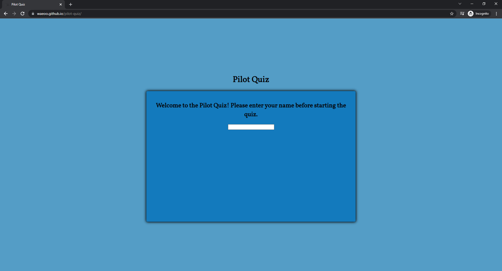

## Testing

Testing has been performed in browsers such as Chrome, Brave, Firefox and Edge using developer tools to check responsiveness. Review responses have been asked and recieved in relation to different iOS and Android devices. No issues reported. Validator testing and compatibilites are listed below.

### Validator Testing 

- HTML Validation (w3c)
    
  - [index.html](https://validator.w3.org/nu/?doc=https://waeoo.github.io/pilot-quiz/index.html)
  - 

  - [quiz.html](https://validator.w3.org/nu/?doc=https://waeoo.github.io/pilot-quiz/quiz.html)
  - 

- CSS (w3c)

  - [style.css](https://jigsaw.w3.org/css-validator/validator?uri=https://waeoo.github.io/pilot-quiz&profile=css3svg&usermedium=all&warning=1&vextwarning=&lang=en)
  - 

### Fixed Bugs

### Unfixed Bugs

At the moment there are no unfixed bugs discovered. 

### Browser compatibility

- Chrome

- Brave

- Firefox

- Edge

### Responsiveness

- Desktop

- Tablet

- Mobile - Real life phone Samsung Internet on Samsung Galaxy S8+

### Tested User Stories

- As a new visitor:
- At first sight you are presented with the home page feature welcome text, explaining what you can read and learn about. Also a picture of the Adaptogens book as clear reference. Through the presented information you intuitivly you can browse towards the Adaptogens link in the navigation feature in ordet to start learning about the different well-researched adaptogens.

- As a general visitor:
- Coming back to the site you can via the swift navigation feature navigate to for example the Adapotgens page and continue your reading and learning about the different well-researched adaptogens. Even further looking in to the About page feautre explaining what conclusions have been drawn and what defines an adaptogen.
During the browsing and learning and in the event of looking for more content or information you are able to use the social media links feature in the footer section. In case of wanting to start a conversation and asking questions you can also navigate to the Contact page feature and fill out a form with your message.

- As a returning visitor:
- As a returning and perhaps frequent visitor I look for any new messages on the homepage. Check the Adaptogen page for any additional features. After having digested some learning material I have additional questions that needs answers and I navigate to the Contact page to fill out the form and send my message of questions seeking answers.