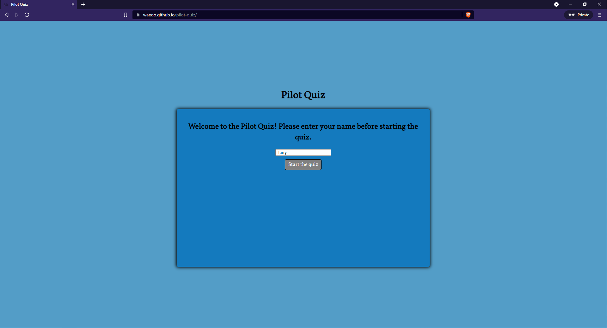
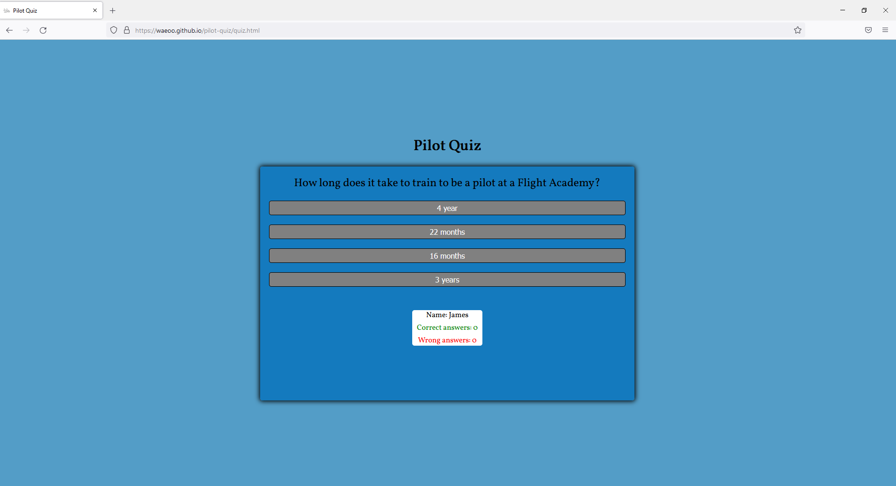

## Testing

Testing has been performed in browsers such as Chrome, Brave, Firefox and Edge using developer tools to check responsiveness. Review responses have been asked and recieved in relation to different iOS and Android devices. No issues reported. Validator testing and compatibilites are listed below.

### Validator Testing 

- HTML Validation (w3c)
    
  - [index.html](https://validator.w3.org/nu/?doc=https://waeoo.github.io/pilot-quiz/index.html)
  - 

  - [quiz.html](https://validator.w3.org/nu/?doc=https://waeoo.github.io/pilot-quiz/quiz.html)
  - 

- CSS (w3c)

  - [style.css](https://jigsaw.w3.org/css-validator/validator?uri=https://waeoo.github.io/pilot-quiz&profile=css3svg&usermedium=all&warning=1&vextwarning=&lang=en)
  - 

### Fixed Bugs

### Unfixed Bugs

At the moment there are no unfixed bugs discovered. 

### Browser compatibility

- Chrome

- Brave

- Firefox

- Edge

### Responsiveness

- Desktop

- Tablet

- Mobile - Real life phone Samsung Internet on Samsung Galaxy S8+

### Tested User Stories

- As a new visitor:
- At first sight you are presented with the home page featuring welcome text and asking you to enter your name. After entering your name a button appears to start the quiz.

- As a general visitor:
- Coming back to the site you can enter your name, start the quiz and be presented with a new set of questions. You can after fininshing 10 questions either restart and take another set of questions or return back to landing page where you can enter a new name for the quiz.

- As a returning visitor:
- As a returning and perhaps frequent visitor I look for more questions to take and learn from. I'm looking for new features to be implemented and for the site to keep track of my scores.